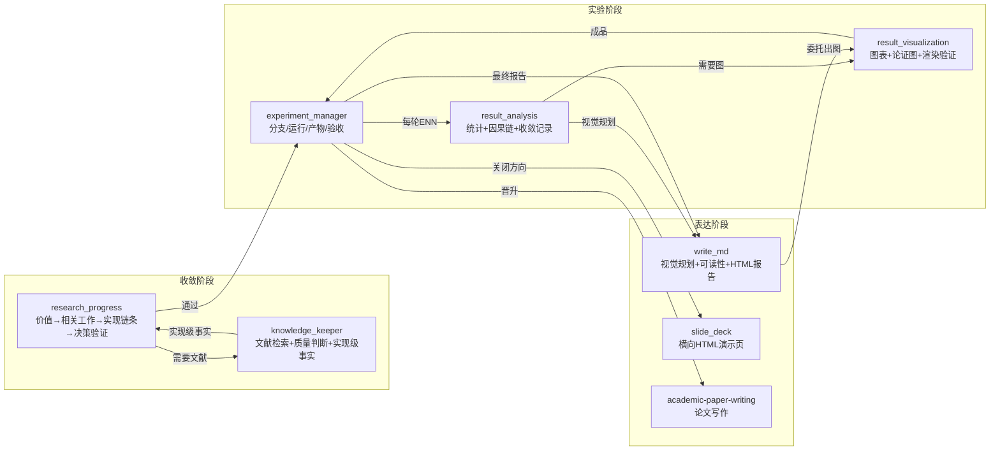

# Research Skill Family 使用指南

一套覆盖科研全生命周期的 11 技能组，位于 `my_skills/`。核心理念：**先落地现实再决定验证什么；每个实验必须收敛一个决策相关的不确定性；价值而非成败决定 checkpoint；实验分支永不直接合并；最终交付物永远是一份图文并茂、证据可追溯的 REPORT.md**。

三条收敛主线：

- **现实收敛**：价值、相关工作现实、实现链条三道审查通过前，不设计实验。
- **认识收敛**：每轮实验缩小活跃解释集或更新主要矛盾；新想法进暂存清单，不自动激活。
- **表达收敛**：只读当前事实源；长报告必过视觉审计与渲染验证，但图的数量不是质量指标。

## 技能触发与边界

每个技能只在特定阶段被加载，越界即浪费上下文。下图展示触发时机与职责边界：




<details>
<summary>📊 等效 SVG 版本（Mermaid 不可用时展开查看）</summary>

<svg viewBox="0 0 960 400" xmlns="http://www.w3.org/2000/svg" font-family="system-ui,-apple-system,sans-serif">
  <defs>
    <marker id="arr" markerWidth="7" markerHeight="7" refX="6" refY="3.5" orient="auto">
      <polygon points="0 0, 7 3.5, 0 7" fill="#95a5a6"/>
    </marker>
    <marker id="arrO" markerWidth="7" markerHeight="7" refX="6" refY="3.5" orient="auto">
      <polygon points="0 0, 7 3.5, 0 7" fill="#e67e22"/>
    </marker>
  </defs>

  <!-- ===== Phase 1: Convergence ===== -->
  <rect x="30" y="30" width="250" height="180" rx="10" fill="#EBF5FB" stroke="#3498db" stroke-width="1.5"/>
  <text x="155" y="60" text-anchor="middle" fill="#2c3e50" font-weight="600" font-size="15">收敛阶段</text>

  <rect x="50" y="76" width="210" height="46" rx="6" fill="#fff" stroke="#3498db" stroke-width="1"/>
  <text x="155" y="95" text-anchor="middle" fill="#2c3e50" font-weight="500" font-size="13">research_progress</text>
  <text x="155" y="112" text-anchor="middle" fill="#7f8c8d" font-size="11">价值 → 相关工作 → 实现链条 → 决策验证</text>

  <rect x="50" y="134" width="210" height="46" rx="6" fill="#fff" stroke="#3498db" stroke-width="1"/>
  <text x="155" y="153" text-anchor="middle" fill="#2c3e50" font-weight="500" font-size="13">knowledge_keeper</text>
  <text x="155" y="170" text-anchor="middle" fill="#7f8c8d" font-size="11">文献检索 + 质量判断 + 实现级事实</text>

  <!-- ===== Phase 2: Experiment ===== -->
  <rect x="350" y="30" width="260" height="180" rx="10" fill="#E9F7EF" stroke="#27ae60" stroke-width="1.5"/>
  <text x="480" y="60" text-anchor="middle" fill="#2c3e50" font-weight="600" font-size="15">实验阶段</text>

  <rect x="370" y="76" width="220" height="46" rx="6" fill="#fff" stroke="#27ae60" stroke-width="1"/>
  <text x="480" y="95" text-anchor="middle" fill="#2c3e50" font-weight="500" font-size="13">experiment_manager</text>
  <text x="480" y="112" text-anchor="middle" fill="#7f8c8d" font-size="11">分支 / 运行 / 产物 / 验收</text>

  <rect x="370" y="134" width="105" height="46" rx="6" fill="#fff" stroke="#27ae60" stroke-width="1"/>
  <text x="422" y="153" text-anchor="middle" fill="#2c3e50" font-weight="500" font-size="12">result_analysis</text>
  <text x="422" y="170" text-anchor="middle" fill="#7f8c8d" font-size="10">统计 + 因果链</text>

  <rect x="485" y="134" width="105" height="46" rx="6" fill="#fff" stroke="#27ae60" stroke-width="1"/>
  <text x="537" y="153" text-anchor="middle" fill="#2c3e50" font-weight="500" font-size="11">result_visualization</text>
  <text x="537" y="170" text-anchor="middle" fill="#7f8c8d" font-size="10">图表 + 论证图</text>

  <!-- ===== Phase 3: Expression ===== -->
  <rect x="680" y="30" width="260" height="180" rx="10" fill="#F4ECF7" stroke="#9b59b6" stroke-width="1.5"/>
  <text x="810" y="60" text-anchor="middle" fill="#2c3e50" font-weight="600" font-size="15">表达阶段</text>

  <rect x="700" y="76" width="220" height="46" rx="6" fill="#fff" stroke="#9b59b6" stroke-width="1"/>
  <text x="810" y="95" text-anchor="middle" fill="#2c3e50" font-weight="500" font-size="13">write_md</text>
  <text x="810" y="112" text-anchor="middle" fill="#7f8c8d" font-size="11">视觉规划 + 可读性 + HTML报告</text>

  <rect x="700" y="134" width="105" height="46" rx="6" fill="#fff" stroke="#9b59b6" stroke-width="1"/>
  <text x="752" y="153" text-anchor="middle" fill="#2c3e50" font-weight="500" font-size="12">slide_deck</text>
  <text x="752" y="170" text-anchor="middle" fill="#7f8c8d" font-size="10">横向HTML演示页</text>

  <rect x="815" y="134" width="105" height="46" rx="6" fill="#fff" stroke="#9b59b6" stroke-width="1"/>
  <text x="867" y="153" text-anchor="middle" fill="#2c3e50" font-weight="500" font-size="11">academic-paper</text>
  <text x="867" y="170" text-anchor="middle" fill="#7f8c8d" font-size="10">论文写作</text>

  <!-- ===== Arrows: main flow (solid gray) ===== -->
  <!-- RP -> EM -->
  <line x1="280" y1="99" x2="344" y2="99" stroke="#95a5a6" stroke-width="1.5" marker-end="url(#arr)"/>
  <text x="312" y="90" text-anchor="middle" fill="#7f8c8d" font-size="10">通过</text>

  <!-- KK -> RP (loop back, clean path) -->
  <path d="M 155 180 L 155 240 L 480 240 L 480 210" fill="none" stroke="#95a5a6" stroke-width="1.2" marker-end="url(#arr)"/>
  <text x="318" y="232" text-anchor="middle" fill="#7f8c8d" font-size="10">实现级事实</text>

  <!-- EM -> RA (down, visible) -->
  <line x1="440" y1="122" x2="440" y2="132" stroke="#95a5a6" stroke-width="2" marker-end="url(#arr)"/>
  <!-- EM -> RV (down, visible) -->
  <line x1="520" y1="122" x2="520" y2="132" stroke="#95a5a6" stroke-width="2" marker-end="url(#arr)"/>

  <!-- EM -> WM -->
  <line x1="610" y1="99" x2="674" y2="99" stroke="#95a5a6" stroke-width="1.5" marker-end="url(#arr)"/>
  <text x="642" y="90" text-anchor="middle" fill="#7f8c8d" font-size="10">最终报告</text>

  <!-- EM -> SD / AP (single label, spread arrows) -->
  <line x1="610" y1="145" x2="694" y2="150" stroke="#95a5a6" stroke-width="1.2" marker-end="url(#arr)"/>
  <line x1="610" y1="158" x2="809" y2="156" stroke="#95a5a6" stroke-width="1.2" marker-end="url(#arr)"/>
  <text x="700" y="138" text-anchor="middle" fill="#7f8c8d" font-size="10">关闭 / 晋升</text>

  <!-- ===== Arrows: visual delegation (dashed orange) ===== -->
  <!-- RA -> WM (visual planning, clean L-path) -->
  <path d="M 422 180 L 422 270 L 810 270 L 810 210" fill="none" stroke="#e67e22" stroke-width="1.2" stroke-dasharray="5,3" marker-end="url(#arrO)"/>
  <text x="616" y="262" text-anchor="middle" fill="#e67e22" font-size="10">视觉规划 → write_md 委托 → result_visualization 出图</text>

  <!-- RV -> EM (deliverable back, shorter path) -->
  <path d="M 537 180 L 537 300 L 480 300 L 480 210" fill="none" stroke="#95a5a6" stroke-width="1.2" marker-end="url(#arr)"/>
  <text x="508" y="292" text-anchor="middle" fill="#7f8c8d" font-size="10">成品</text>

  <!-- ===== Legend ===== -->
  <line x1="30" y1="340" x2="930" y2="340" stroke="#ecf0f1" stroke-width="1"/>
  <text x="30" y="362" fill="#95a5a6" font-size="11">实线 = 主流程&#160;&#160;&#160;&#160;虚线 = 视觉委托&#160;&#160;&#160;&#160;research_manager 贯穿全局（状态 / 归档 / 汇报），不参与单次任务 pipeline</text>
</svg>

</details>

| 技能 | 什么时候加载 | 什么时候**不**加载 |
|------|-------------|-------------------|
| `research_progress` | 有新想法、问"值得做吗"、需要收敛方向 | 已有明确实验计划、只需要执行 |
| `knowledge_keeper` | 需要查文献、判断论文质量、落库知识 | 问题与文献无关、已有本地知识 |
| `experiment_manager` | 用户说"开始实验"、跑 ENN、关闭方向 | 还在讨论想法、没有通过的提案 |
| `result_analysis` | 有实验数据需要解读、需要 停/转向/继续 判断 | 数据还没产生、只需要可视化 |
| `result_visualization` | 需要出图（数据图/流程图/论证图）、渲染验证 | 纯文本足够、没有数据或结构需要编码 |
| `write_md` | 长报告需要视觉规划或最终可读性检查、需要 HTML 报告 | 短文档、初稿内容还没定 |
| `academic-paper-writing` | 需要写论文、润色稿件 | 实验还没产生可写的结果 |
| `slide_deck` | 需要横向翻页 HTML 演示（代替 PPT） | 需要纵向滚动报告（那是 write_md 的活） |
| `research_manager` | 需要初始化项目、归档、状态汇报、管理目录 | 具体实验执行或文献检索 |
| `skill_rsi` | 使用中暴露了技能组的问题、用户的纠正值得沉淀 | 研究项目本身的产物和决定 |
| `plain_talk` | 每次会话开始（必加载，不等触发）：禁黑话、说人话 | — |

技能按需加载：基础层 + 1–2 个相关技能即可。报告类任务自动叠加 analysis → write_md（规划）→ visualization → write_md（终检），不需要逐个触发。

## 目录约定（`.kilo/`）

```
.kilo/
├── TODO.md        # 项目进展唯一来源：主线 → 阶段 → 当前方案 三层树，带方向文件链接
├── global.md      # 纯索引备查（≤60 行）：四目录指针，不写目标和规则
├── proposal/      # 评估中/阻塞/就绪的方向：proposal/NN-slug/
├── project/       # 进行中的方向（只存在于 exp/NN-slug 实验分支上）
├── archive/       # 已关闭方向：archive/YYYY-MM-DD-NN-slug/
├── reports/       # 生成的状态快照：YYYY-MM-DD-status.md
└── knowledge/     # 文献笔记 + 查询日志
```

**会话开始：先读 `AGENTS.md`（有的话）和 `TODO.md`，顺着 TODO 里的链接读对应方向文件**，不整树加载。TODO.md 由 `research_manager` 创建和维护，其他技能只读。

下游科研项目根目录可选 `AGENTS.md`：**只有你维护、Agent 只读**的研究宪法（进展定义、实验纪律、真相层级、上下文纪律）。模板见根目录 `AGENTS_template.md`，复制到项目根并按需裁剪。建议同时在 Kilo 配置中对该路径设 `edit: deny` 并用 Git 跟踪。

真相层级（冲突时从高到低）：`AGENTS.md` → `global.md` → 方向 `00-overview.md` → 已登记实验计划 → 运行报告 → 文献笔记 → 生成的状态快照。会话开始读法见上面"目录约定"。

## 典型流程

### 1. 提出并收敛一个想法

```
你："我有个想法：用 X 方法解决 Y 问题，值得做吗？"
```

`research_progress` 按固定顺序过四道关，**不允许从抽象概念直接跳到实验设计**：

1. **值不值得做**——解决谁的瓶颈、最好结果是否足以支撑有意义的主张；只换说法不算价值
2. **别人做到了哪**——委托 `knowledge_keeper` 检索；最近直接工作必须给出实现级事实（真实数据/训练目标/代码状态/算力/失败边界）。摘要级阅读只能支持"值得一读"，不能支持"可行"或"空白成立"。有人做过同题不等于不能做：高质量完整解决才是真冲突；占坑但做得差只是设了下限
3. **造得出来吗**——写出输入→数据→模块→张量→训练信号→推理→输出→评价的端到端链条，每个箭头标注 `已验证/有依据/猜测/不知道`。**核心链上连续两个 猜测/不知道 → 状态"卡住"，禁止实验设计**。可委托 `result_visualization` 画实现链/对齐/风险图暴露概念跳跃
4. **先验证什么**——只设计会改变"继续/转向/停止"决定的最小证据；结果 A/B/含糊分别对应什么动作必须事先写明

产出：`否决` / `卡住` / `评估中` / `通过` 与猜想清单（说法、依据、状态、错了的代价、最便宜验证）。就绪评估写入 `proposal/NN-slug/experiment-plan.md`。没有参照文献、质量线和实现链条的提案不能通过。

### 2. 开始实验

```
你："GO，开始做这个方向。"
```

`experiment_manager` 创建 `exp/NN-slug` 分支（优先独立 worktree），在实验分支上把方向从 `proposal/` 移到 `project/`。**主分支上方向仍在 proposal/ 中**——失败时探索性代码随分支丢弃，不污染主线。

### 3. 实验循环（假设 → 实验 → 对照假设）

每次运行编号 `ENN`，绑定**一个主要假设 + 当前主要矛盾**，流程固定：

1. 冻结预期：baseline 及不确定性、预期性能区间、预期机制信号、因果链、各结果的对应动作
2. 尽量只改一个受控因子；执行
3. `result_analysis` 对照假设：**先定位哪条因果边成立或断裂**（实验有效性→干预→机制→目标→价值），再做统计分析。**偏差不自动等于该改局部模块**——局部异常只有能解释主要偏差时才升级为主问题，否则进暂存清单
4. 产出**收敛记录**：主要假设（支持/削弱/未检验）、活跃解释数（必须缩小或说明理由）、主要矛盾更新、暂存的新问题、下一决策
5. 判**实验价值**：

| 价值 | 含义 | 动作 |
|------|------|------|
| `有信息` | 实质更新假设或决策 | 存档 |
| `可复用` | 产出方向无关的可复用资产 | 存档 |
| `无价值` | 无效/冗余/决策中性 | 不提交，记录排除原因并清理输出 |

反发散规则：没有"改了哪个判断"就不开新实验；禁止"再改一点看看"；**连续两轮未缩小决策相关不确定性 → 停止实验序列，退回 `research_progress` 重新界定问题**。

### 4. 报告生产（自动叠加可视化）

长报告（ENN 报告、REPORT.md）按固定编排生产：

1. `result_analysis` 确定证据与主张，执行**视觉需求审计**（可以考虑后选择纯文本，但必须记录理由）
2. `write_md` 第一次调用：视觉规划，确定图的位置、目的、产物类别
3. `result_visualization` 生成图（matplotlib 数据图 / Mermaid、SVG 流程图），保留可复现 `.py` 源 + `.svg/.pdf` + `.png` 预览
4. `experiment_manager` 嵌入报告并做**视觉验收**：链接可解析、图实际渲染、图注含比较对象/观测单位/不确定性/结论
5. `write_md` 第二次调用：最终可读性检查（30 秒扫描路径、无整屏文字墙）

**没有完成视觉审计和渲染验证，不宣布长报告完成。** 图的数量不是质量指标。

### 5. 关闭方向

- **证伪**：综合所有有价值运行报告为 `REPORT.md`，只把报告包应用回主分支 `archive/`，不合并探索性代码
- **验证**：从目标 base 建干净的 `promote/NN-slug` 分支，只挑有效实现 + 测试 + 最小配置 + 报告包，合并 promote 分支（**永远不直接合并 exp 分支**）
- **转向**：旧假设归档为"被取代"，新建提案编号，不静默改写历史

### 6. 状态汇报

```
你："帮我整理一份项目进展汇报。"
```

`research_manager` 生成 `.kilo/reports/YYYY-MM-DD-status.md`：本期结论（≤3 行）、当前规划、进行中进展（最新 ENN 判定、距停手/做成标准的距离）、本期关闭方向及教训、下期计划与风险。快照是**生成物，永不手工维护**；相邻两份直接 diff 即可回答"和上次比有什么变化"。

### 7. HTML 产物：报告 vs 演示

- **纵向滚动 HTML 报告**（阅读用）：`write_md` 从最终 REPORT.md 生成，自包含、目录锚点、图片可放大、离线可读、可打印，内容变更后重新生成而非手工维护副本
- **横向翻页 HTML 展示页**（汇报用，代替 PPT）：`slide_deck` 生成单个自包含文件，`←`/`→` 翻页、页码、打印即 PDF 讲义；每页数字页脚标注来源工件，结尾附来源清单；新图表委托 `result_visualization`，统计结论委托 `result_analysis`——展示页不创造内容，只重编码已批准的证据；样式集中在 `:root` CSS 变量块，已存风格模板（国自然基金风格、瑞士国际主义风格）可点名复用

## 输出契约（所有技能共同遵守）

- 先说结论，再给必要依据和下一步
- 默认短句和常用词；术语只在更准确时用，首次出现直接解释
- 内部状态、流程和检查表默认不展示；只有影响决定或用户明确要求时才展开
- 外部事实、论文结论和数字附来源；不确定的直接写"尚未验证"或"我推测"，不给每句话机械加事实/猜测标签
- 一段能说清就不用表格；独立要点用列表；只有横向比较才用表格
- 不写套话、廉价肯定、重复总结和固定收尾
- 禁用黑话和自造词（赋能、闭环、抓手、对齐、链路、落地、打磨等），直接说具体那件事
- 写文件前先经用户确认
- 只在发现具体的过时或重复内容时才提议清理，不作为固定收尾动作

## 关键边界

- **Git 变更需显式授权**：commit、删分支、合并都要你确认
- **产物白名单制**：Git 只收小决策表、最小配置、分析脚本、最终图；checkpoint、缓存、数据副本、完整日志一律排除，大产物走外部 manifest 追踪
- **文献只经 `knowledge_keeper`**：检索一次必落库，禁止重复检索和编造引用；被依赖的论文必须有角色/质量/阅读深度三字段判断
- **参照文献定水平线**：跟的论文质量决定课题水平；实验必须包含来自参照文献的强对照，只超弱竞争者不算达标
- **状态转换所有权唯一**：目录移动、归档只由 `research_manager`（或其委托的 `experiment_manager`）执行
- **`AGENTS.md` 只由你写**（下游项目）：Agent 不得修改；它定过程政策，事实以实验证据为准。本仓库不提供项目级 AGENTS.md，只提供模板
- **任何技能不得静默改写另一技能的科学判断**

## 文件位置

```
my_skills/
├── 00-overview.md            # 技能组总览（先读这个）
├── research_manager/SKILL.md
├── research_progress/SKILL.md
├── knowledge_keeper/SKILL.md
│   └── paper-quality.md        # 论文质量判断规则（角色/质量/阅读深度）
├── experiment_manager/SKILL.md
├── result_analysis/SKILL.md
├── result_visualization/SKILL.md
├── write_md/SKILL.md
├── academic-paper-writing/SKILL.md
├── slide_deck/SKILL.md
├── skill_rsi/SKILL.md
└── plain_talk/SKILL.md               # 禁黑话、说人话（每次会话必加载）
```
