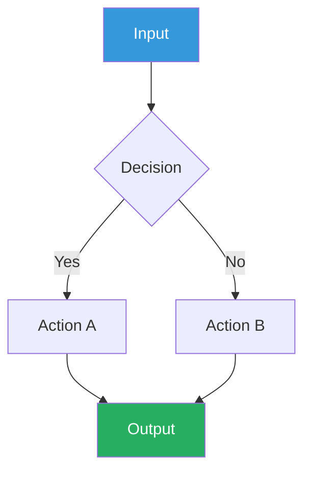
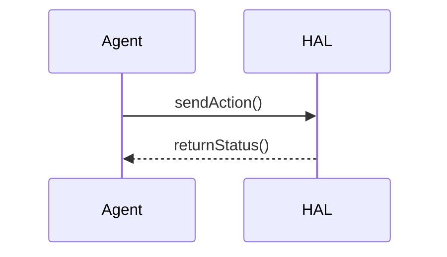

# Research Visualize — 可视化工具

> Related: [result_analysis](result_analysis), [write_md](write_md), [write_paper](write_paper), [research_manager](research_manager)

---

## 0. 职责边界

| 模式 | 职责 | 不包含 |
|------|------|--------|
| **Mode 1: 统计绘图** | 实验数据 → matplotlib/seaborn 论文级图表 | 交互式图表（plotly）、三维可视化 |
| **Mode 2: 图表绘制** | Mermaid 标准图（流程图/时序图/类图等） | HTML div 盒子（委托给 write_md） |

**与 write_md 的分工**: Mermaid 处理标准图类型（流程图、时序图、类图、状态图、ER 图、甘特图）；write_md 的 HTML div 盒子处理需要自由布局和语义配色的视觉化内容。两者互补，不替代。

---

## 1. Mode 1: 统计绘图（Statistical Plotting）

### 1.1 触发条件

- 用户提供数值数据（表格、CSV、JSON、内联数字）并说"画图"/"可视化"/"plot"/"chart"
- `result_analysis` 结束后说"把结论画出来"或"生成图表"
- 用户描述"我想看 X 和 Y 的关系"/"对比 A 和 B 的性能"

### 1.2 输入约定

接受以下输入格式，优先从用户直接提供的数据中提取：

| 输入类型 | 示例 | 注意事项 |
|---------|------|---------|
| Markdown 表格 | `| Method | Acc | F1 |` | 首行为列名 |
| Python dict/list | `{"method": ["A","B"], "acc": [0.9, 0.85]}` | 明确 x/y/分组变量 |
| CSV 路径 | `results/experiment-01.csv` | 确认分隔符和编码 |
| 内联数字 | "方法A 90%, 方法B 85%, 方法C 88%" | 需转换为结构化数据 |

**必须明确的信息**（缺失时直接提问，不猜测）：
- x 轴变量（哪个字段作为横轴）
- y 轴变量（哪个字段作为纵轴）
- 分组/分类变量（hue，如不同方法/数据集）
- 图表标题（默认从数据上下文推断）

### 1.3 绘图类型选择指南

| 需求场景 | 图表类型 | 推荐库/函数 | 关键参数 |
|---------|---------|------------|---------|
| 多方法对比多个指标 | 分组柱状图 | `sns.barplot` | hue, errorbar=('ci', 95) |
| 训练/收敛曲线 | 折线图 | `plt.plot` | marker, linewidth=1.5 |
| 消融实验对比 | 水平柱状图 | `plt.barh` | 按值排序 |
| 超参数敏感度 | 折线图+误差带 | `sns.lineplot` | errorbar='sd' |
| 数据分布对比 | 箱线图 / 小提琴图 | `sns.boxplot` / `sns.violinplot` | cut=0 |
| 相关性矩阵 | 热力图 | `sns.heatmap` | annot=True, cmap='coolwarm' |
| 散点分布+趋势 | 散点图+回归线 | `sns.regplot` | scatter_kws={'alpha':0.5} |
| 多方法排序 | 条形图 | `sns.barplot` | order=排序列表 |
| 组成/占比 | 饼图 | `plt.pie` | autopct='%1.1f%%' |
| 双变量关系矩阵 | 散点矩阵 | `sns.pairplot` | hue, diag_kind='kde' |
| 多个子图对比 | 子图网格 | `plt.subplots` | nrows, ncols, figsize |

### 1.4 matplotlib/seaborn 最佳实践

**配色**：
- 优先使用 `sns.color_palette("colorblind")` 确保色盲友好
- 论文场景用 `sns.color_palette("muted")` 或自定义 `['#3498db','#e74c3c','#27ae60','#9b59b6','#e67e22']`
- 避免红绿搭配作为唯一区分手段

**尺寸**：
- 论文单栏：`figsize=(3.5, 2.5)`（inch）
- 论文双栏：`figsize=(7, 3)`（inch）
- 演示/PPT：`figsize=(8, 5)`（inch）

**字体与标签**（中文支持）：
```python
plt.rcParams['font.sans-serif'] = ['SimHei', 'DejaVu Sans']
plt.rcParams['axes.unicode_minus'] = False
```
- 轴标签：12pt，刻度：10pt，标题：14pt
- LaTeX 公式使用 `r"$\\alpha$"` 格式

**输出格式**：
- 矢量（论文插入）：PDF
- 预览：PNG，DPI ≥ 300
- 始终使用 `plt.savefig(fname, bbox_inches='tight', pad_inches=0.05)` 避免裁切
- 文件名：`NN-{描述}.{pdf|png}`，NN 为两位数字前缀

**必须包含的元素**：
- 轴标签（含单位）
- 图例（多系列时）
- 误差线（如有标准差/置信区间）
- 数据来源标注（可选，实验报告中推荐）

### 1.5 输出与保存

绘图脚本和产物均保存到 `project/` 目录。

**保存位置**：
```
project/{实验目录}/
├── 00-overview.md
├── NN-experiment-report.md          ← 实验报告
├── NN-plot-{描述}.pdf               ← 矢量图（论文用）
└── NN-plot-{描述}.png               ← 位图（预览用）
```

**文件名约定**（遵循 research_manager）：
- 两位数字前缀，如 `03-plot-ablation-comparison.pdf`
- 数字为目录内已有最大编号 + 1
- 小写连字符命名

**00-overview.md 更新**：生成图表后，在实验目录的 `00-overview.md` 中追加图表条目。

---

## 2. Mode 2: 图表绘制（Diagramming）

### 2.1 触发条件

- 用户描述架构/流程/时序关系并说"画流程图"/"画架构图"/"画时序图"/"画类图"
- 用户说"用 Mermaid 画..." 或提供 Mermaid 代码片段需要调试
- 用户说"这个方法的流程是什么，画出来"

### 2.2 图表类型 → 工具选择

| 图表类型 | 工具 | 理由 |
|---------|------|------|
| 流程图（Flowchart） | Mermaid | 标准语法，GitHub/Notion/VS Code 原生渲染 |
| 时序图（Sequence） | Mermaid | participant/message 语义清晰 |
| 类图（Class） | Mermaid | 继承/组合关系自动布局 |
| 状态图（State） | Mermaid | 状态转换语义 |
| ER 图（Entity Relationship） | Mermaid | 实体关系建模 |
| 甘特图（Gantt） | Mermaid | 时间线项目管理 |
| 自由布局+语义配色 | HTML div 盒子 | 委托 [write_md](write_md)，需要视觉强调和颜色语义 |
| 架构图（自由布局） | HTML div 盒子 | 委托 [write_md](write_md) §3 |

**选择规则**：如果图表可以用标准图形类型（矩形、菱形、箭头、泳道）表达，用 Mermaid。如果需要自定义布局、颜色语义、嵌套结构等视觉效果，用 write_md 的 HTML 盒子。

### 2.3 Mermaid 最佳实践

**配色映射**（使用 write_md §1 语义调色板）：
```
%%{init: {'themeVariables': {
  'primaryColor': '#3498db',
  'primaryTextColor': '#fff',
  'lineColor': '#7f8c8d',
  'tertiaryColor': '#f5eef8'
}}}%%
```

**节点命名**：
- 模块/组件：PascalCase，如 `PlannerModule`、`HALWatchdog`
- 函数/方法：camelCase，如 `observeState`、`executeAction`
- 数据/文件：UPPER_SNAKE，如 `ACTION.md`、`ENVIRONMENT.md`

**复杂度控制**：
- 单图 ≤ 15 节点，超过时拆分为子图
- 流程方向：优先 TB（上到下），系统架构用 LR（左到右）
- 避免交叉连线：调整节点声明顺序减少交叉

**语法模板**：





### 2.4 输出与保存

**Mermaid 代码块**：优先写入目标 Markdown 文件的 ` ```mermaid ` 代码块中，与文档上下文共存。

**独立 .mmd 文件**：当图表需要多文档复用或版本管理时：
```
project/{模块目录}/
└── NN-diagram-{描述}.mmd
```

**HTML 图表**：不在此技能中生成——指导用户加载 `write_md` 技能，共享语义调色板后生成 HTML 盒子。

---

## 3. 与技能族的集成

### 3.1 衔接 result_analysis

**Handoff 协议**：`result_analysis` 在结论中输出"可视化建议"时，本技能直接执行绘图：

```
result_analysis 输出示例：
## 可视化建议
| 图表 | 类型 | 数据来源 | 关键对比 |
|------|------|---------|---------|
| 消融对比 | 水平柱状图 | Step 3 置信度表 | H1 prior vs posterior |
| 训练曲线 | 折线图 | experiment-03.csv | loss over epochs |
```

触发后，从 `project/` 下的实验目录读取数据文件，按建议生成图表。

如果 `result_analysis` 未输出可视化建议但用户说"画图"，自动从分析结论中提取可绘图数据。

### 3.2 衔接 write_md

- **共享语义调色板**：本技能 Mermaid 配色和 matplotlib 配色均使用 write_md §1 定义的语义调色板
- **HTML 委托**：需要自由布局的架构图，指导用户加载 `write_md`，本技能只负责 Mermaid 标准图
- **嵌入关系**：本技能生成的 Mermaid 代码块可直接嵌入 write_md 生成的 Markdown 文档中

### 3.3 衔接 research_manager

- 所有输出文件遵循 research_manager 的命名约定（两位数字前缀、小写连字符）
- 生成文件后更新对应目录的 `00-overview.md`
- 文件保存到 `project/` 的子目录，不污染顶层
- YAML frontmatter 状态标签：图表文件不适用；绘图脚本标注 `🟡 WIP` / `🟢 Stable`

### 3.4 衔接 write_paper

- 统计图表直接生成 PDF 矢量格式，可插入 LaTeX 论文
- 图片尺寸预设论文单栏/双栏规格
- 配色方案与 write_paper 的"Colorblind-safe palettes. No red-green"约束对齐

---

## 4. 输出约定

### 4.1 文件命名

| 产物类型 | 命名格式 | 示例 |
|---------|---------|------|
| 绘图脚本 | `NN-plot-{描述}.py` | `03-plot-ablation.py` |
| 矢量图 | `NN-plot-{描述}.pdf` | `03-plot-ablation.pdf` |
| 预览图 | `NN-plot-{描述}.png` | `03-plot-ablation.png` |
| Mermaid 文件 | `NN-diagram-{描述}.mmd` | `04-diagram-architecture.mmd` |

NN 为当前目录已有最大编号 + 1（遵循 research_manager）。

### 4.2 目录结构

```
project/{实验或模块目录}/
├── 00-overview.md                ← 更新：追加图表条目
├── NN-plot-{描述}.py             ← 绘图脚本
├── NN-plot-{描述}.pdf            ← 矢量图
├── NN-plot-{描述}.png            ← 预览图
└── NN-diagram-{描述}.mmd         ← Mermaid 源文件
```

### 4.3 00-overview.md 更新模板

图表生成后，在 `00-overview.md` 追加：
```markdown
| `NN-plot-{描述}.pdf` | `🟢 Stable` | 统计图表 | 来源：result_analysis 分析结论 |
| `NN-diagram-{描述}.mmd` | `🟢 Stable` | 架构图 | 描述系统 X 的模块关系 |
```

---

## 5. 全局约束

- **不猜测数据**：数据不完整时直接提问，不填补缺失值
- **不生成假数据**：不编造实验数据来演示绘图
- **不支持交互式图表**：仅静态 PDF/PNG/SVG 输出
- **不替代 write_md**：HTML div 盒子始终委托给 write_md
- **文件写入需用户确认**：绘图脚本和图片在用户确认后保存，不主动落盘
- **中文支持**：图表标题/标签含中文时，自动添加 SimHei 字体配置
- **不包含图像 API prompt 生成**：该功能预留后续扩展
