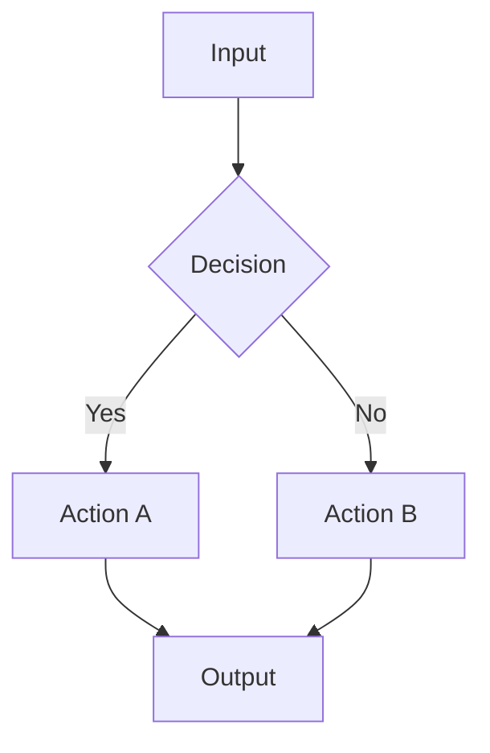
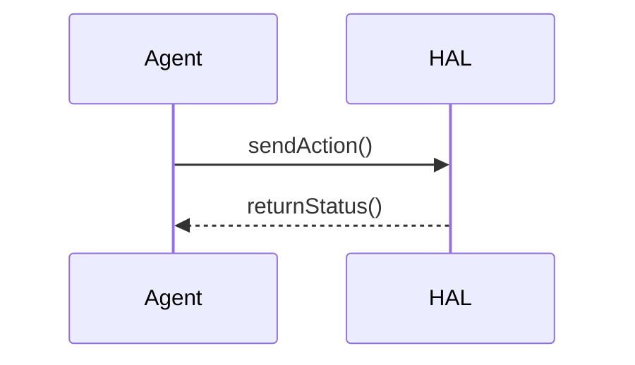

# Plotting Reference for result_analysis

Reference-only: load when `result_analysis` needs to generate a chart or diagram.

## 1. Chart Type Selection

| Scenario | Chart | Library call | Notes |
|----------|-------|--------------|-------|
| Multiple methods across metrics | grouped bar | `sns.barplot` | `hue`, `errorbar=('ci', 95)` |
| Training / convergence curve | line | `plt.plot` | `marker`, `linewidth=1.5` |
| Ablation comparison | horizontal bar | `plt.barh` | sort by value |
| Hyper-parameter sensitivity | line + band | `sns.lineplot` | `errorbar='sd'` |
| Distribution comparison | box / violin | `sns.boxplot` / `sns.violinplot` | `cut=0` |
| Correlation matrix | heatmap | `sns.heatmap` | `annot=True`, `cmap='coolwarm'` |
| Scatter + trend | regplot | `sns.regplot` | `scatter_kws={'alpha':0.5}` |
| Composition / proportion | pie | `plt.pie` | `autopct='%1.1f%%'` |
| Multi-panel comparison | subplots | `plt.subplots` | `nrows`, `ncols`, `figsize` |

## 2. matplotlib / seaborn Best Practices

**Colorblind-safe palettes** (use one):

```python
sns.color_palette("colorblind")
sns.color_palette("muted")
['#3498db', '#e74c3c', '#27ae60', '#9b59b6', '#e67e22']
```

Avoid red-green as the only channel.

**Figure sizes** (inches):

- Paper single column: `(3.5, 2.5)`
- Paper double column: `(7.0, 3.0)`
- Presentation: `(8.0, 5.0)`

**Chinese font support** (when needed):

```python
plt.rcParams['font.sans-serif'] = ['SimHei', 'DejaVu Sans']
plt.rcParams['axes.unicode_minus'] = False
```

**Required elements**:

- Axis labels with units
- Legend when multiple series
- Error bars when standard deviation / confidence interval exists
- Source annotation in experiment reports (recommended)

**Output**:

```python
plt.savefig('NN-plot-{desc}.pdf', bbox_inches='tight', pad_inches=0.05)
plt.savefig('NN-plot-{desc}.png', dpi=300)
```

Use PDF for papers, PNG for previews.

## 3. Mermaid Templates

**Flowchart**:



**Sequence**:



**Color init** (optional):

```text
%%{init: {'themeVariables': {
  'primaryColor': '#3498db',
  'primaryTextColor': '#fff',
  'lineColor': '#7f8c8d',
  'tertiaryColor': '#f5eef8'
}}}%%
```

Keep a single diagram ≤15 nodes; split if larger.

## 4. File Naming

| Product | Pattern | Example |
|---------|---------|---------|
| Plot script | `NN-plot-{desc}.py` | `03-plot-ablation.py` |
| Vector figure | `NN-plot-{desc}.pdf` | `03-plot-ablation.pdf` |
| Preview | `NN-plot-{desc}.png` | `03-plot-ablation.png` |
| Mermaid source | `NN-diagram-{desc}.mmd` | `04-diagram-architecture.mmd` |

`NN` is the current maximum prefix in the target directory + 1.

## 5. Save Location

Save to the relevant `project/` subdirectory. Update the directory's `00-overview.md` with the new figure entry.
