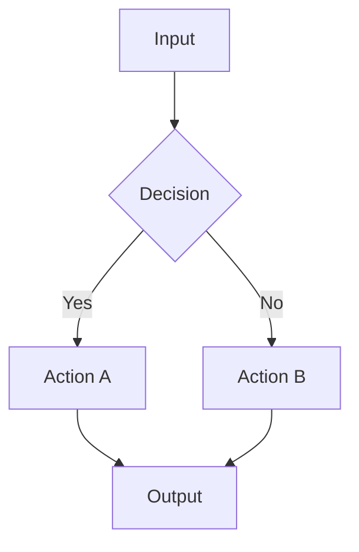
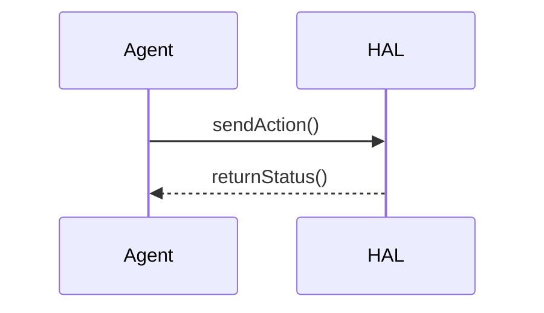

# Plotting Reference for result_visualization

Reference-only: load when `result_visualization` needs to produce a chart or diagram.

## 1. Chart Type Selection

| Analytical question | Form | Notes |
|---|---|---|
| Distribution of one variable | histogram, KDE, box, violin, strip | Show raw points when n is small |
| Paired or repeated observations | paired points/lines, slope graph, before-after dot | Preserve observational unit |
| Trend over steps | line | Mark uncertainty unit (std, stderr, CI) explicitly |
| Comparison across groups | dot plot, small multiples, ordered bar | Avoid aggregate bars when distribution matters |
| Relationship between two variables | scatter, heatmap, contour | Avoid dual y-axes |
| Calibration or residuals | reliability diagram, residual plot, Q-Q | Include reference line |
| Sensitivity / ablation | ordered dot/bar, interaction plot | Sort by magnitude or logical order |
| Composition or proportion | stacked bar, treemap, or table | Pie only when the story is explicitly part-to-whole |
| Multi-panel comparison | subplots with consistent scales | One comparison per panel |

## 2. matplotlib / seaborn Best Practices

**Colorblind-safe palettes** (use one):

```python
sns.color_palette("colorblind")
sns.color_palette("muted")
['#3498db', '#e74c3c', '#27ae60', '#9b59b6', '#e67e22']
```

Avoid red-green as the only channel. Test figures in grayscale.

**Figure sizes** (inches):

- Paper single column: `(3.5, 2.5)`
- Paper double column: `(7.0, 3.0)`
- Presentation: `(8.0, 5.0)`

**Font detection** (do not assume `SimHei`):

```python
import matplotlib.font_manager as fm
available = [f.name for f in fm.fontManager.ttflist]
# select a font that actually exists
```

**Required elements**:

- Axis labels with units
- Legend when multiple series
- Uncertainty representation only when derived from valid observations
- Source annotation in the plotting script

**Uncertainty warning**: `seaborn` confidence intervals require suitable raw observations and an appropriate resampling unit. Do not synthesize uncertainty from aggregate rows or pseudo-replicates. If only means are available, plot points without error bars and note the limitation.

**Output**:

```python
plt.savefig('NN-plot-{desc}.pdf', bbox_inches='tight', pad_inches=0.05)
plt.savefig('NN-plot-{desc}.png', dpi=300)
```

Use PDF/SVG for durable vector use, PNG only when a preview or raster target is needed. Treat `NN-plot-{desc}.py`, `.pdf`, `.svg`, and `.png` sharing one prefix as one artifact bundle.

## 3. Mermaid Templates

**Flowchart**:



**Sequence**:



**Color init** (optional):

```text
%%{init: {'themeVariables': {
  'primaryColor': '#3498db',
  'primaryTextColor': '#fff',
  'lineColor': '#7f8c8d',
  'tertiaryColor': '#f5eef8'
}}}%%
```

Keep a single diagram ≤15 nodes; split if larger.

**Inline SVG fallback** (only when Mermaid cannot express the layout):

```svg
<svg viewBox="0 0 640 360" xmlns="http://www.w3.org/2000/svg" font-family="sans-serif">
  <rect x="20" y="20" width="180" height="60" rx="6" fill="#3498db1a" stroke="#3498db"/>
  <text x="110" y="55" text-anchor="middle" fill="#2c3e50">Stage A</text>
</svg>
```

Rules:

- Self-contained: inline styles only; no external fonts, scripts, or images.
- Reuse the semantic palette from `write_md` §4 (`#3498db` info, `#27ae60` success, `#e67e22` caution, `#e74c3c` danger, `#2c3e50` framework).
- Always set `viewBox`; never rely on fixed pixel dimensions that overflow narrow views.
- Same node budget as Mermaid; split larger schematics.
- Record the artifact class (`diagnostic` / `evidence` / `explanatory`) in a file-header comment.

## 4. File Naming

| Product | Pattern | Example |
|---|---|---|
| Plot script | `NN-plot-{desc}.py` | `03-plot-ablation.py` |
| Vector figure | `NN-plot-{desc}.pdf` | `03-plot-ablation.pdf` |
| Raster preview | `NN-plot-{desc}.png` | `03-plot-ablation.png` |
| Mermaid source | `NN-diagram-{desc}.mmd` | `04-diagram-architecture.mmd` |
| Inline SVG schematic | `NN-diagram-{desc}.svg` | `05-diagram-pipeline.svg` |

`NN` is the current maximum prefix in the target directory + 1.

## 5. Save Location and Overview Updates

Save to the active direction or a user-specified location, not unconditionally under `project/`. Record input path/version and relevant transformations in the plotting script so retained figures are reproducible.

Update the direction `00-overview.md` for retained figures only. Update a collection overview only when that overview already exists. Never register disposable diagnostics.

## 6. Report-Ready Captions

A caption must state: the comparison, observational unit, uncertainty semantics, and takeaway without overstating the analysis. Example: "Mean validation accuracy across 5 independent runs (points); shaded region spans the observed range, not a confidence interval."
